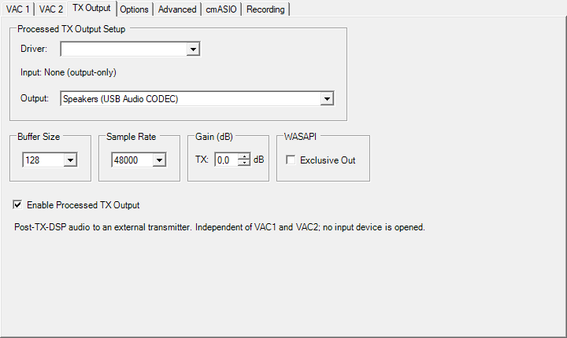
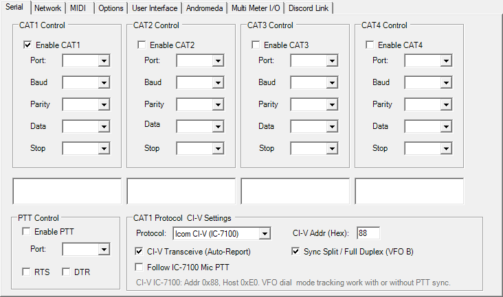
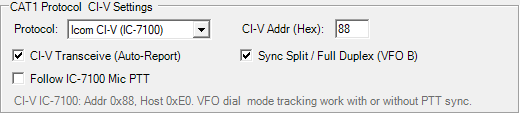

# Hybrid SDR Branch E — Icom CI-V Integration & Processed TX Output Stabilization

Branch E combines full bidirectional Icom CI-V protocol control with the stabilized independent processed-TX audio output for the **Red Pitaya RX + Thetis DSP + Icom IC-7100 RF TX** hybrid station architecture.

---

## 1. Overview & Operational Architecture

The Hybrid SDR station combines the best characteristics of direct-sampling software-defined reception with an analog/digital RF transceiver:

- **Primary Receiver (RX)**: Red Pitaya SDR running OpenHPSDR/Hermes protocol, providing exceptional receiver sensitivity, wideband panoramic waterfall display, and low phase noise directly inside Thetis.
- **DSP Processing Engine (Thetis)**: Performs full audio filtering, parametric microphone equalization, compression, downward expansion (DEXP), and leveler management.
- **RF Transmitter (TX) & PA**: Icom IC-7100 connected via USB, acting as the RF exciter, final power amplifier, band switching unit, and antenna tuner controller.
- **Independent Audio Routing**:
  - **VAC 1**: Dedicated to digital mode software (WSJT-X, JS8Call) or headset input.
  - **VAC 2**: 100% preserved and untouched for its original role as RX2 / second receiver audio.
  - **Setup → Audio → TX Output**: A dedicated post-DSP audio channel (powered by PortAudio / `ChannelMaster.dll`) sending fully processed transmit audio directly to the IC-7100 USB Audio CODEC.
- **Bidirectional CAT Control**: Native Icom CI-V protocol implementation running on CAT 1, synchronizing frequency, modulation mode, data modes, filter bandwidths, split VFO operation, and optional microphone PTT tracking.

---

## 2. Key Enhancements & Technical Implementations

### 2.1 Processed TX Output Crash Root-Cause Analysis & Fix

In earlier iterations of Branch D, enabling Processed TX Output occasionally caused an immediate `0xC0000005` Access Violation crash in `ChannelMaster.dll` or `ntdll.dll` during startup or sample rate switching.

#### Root-Cause Mechanics
1. **Startup Race Condition**: In `console.cs`, `Audio.EnableProcessedTXOutput(true)` was previously called *before* `psform.ForcePS()` and `Audio.Start()`.
2. **Resampler Deallocation**: Roughly 100 ms later, `psform.ForcePS()` executed `cmaster.SetXmtrChannelOutrate(...)`, which invoked `SetIVACaudioRate(...)` -> `destroy_resamps(a)` -> `DeleteCriticalSection(&a->cs_ring)`.
3. **PortAudio Callback Collision**: The PortAudio audio output stream was already actively processing audio callbacks on a high-priority multimedia thread. As `xrmatchOUT(a->rmatchOUT, out_ptr)` was called, it attempted to enter `cs_ring`. Because `cs_ring.DebugInfo` had been freed, the thread encountered a null-pointer write to `0x24` inside `ntdll.dll!RtlpEnterCriticalSectionContended`, immediately terminating the application.
4. **Sample Rate Switch Collision**: Changing sample rates in `SampleRateTX.set` triggered the same resampler destruction while the output stream was actively running.

#### The Branch E Resolution
- **Startup Sequencing**: In [`console.cs`](file:///c:/Users/peter/OneDrive/Documents/Thetis/Project%20Files/Source/Console/console.cs#L27295), `Audio.EnableProcessedTXOutput(true)` was moved to execute strictly *after* `Audio.Start()` has completed and the audio subsystem is fully stable.
- **Stream Interlocking in `audio.cs`**: In [`audio.cs:EnableProcessedTXOutput`](file:///c:/Users/peter/OneDrive/Documents/Thetis/Project%20Files/Source/Console/audio.cs#L1825), the method now guards against uninitialized state (`if (console == null || !console.PowerOn) return;`) and explicitly stops any running stream (`ivac.StopAudioIVAC(id)`) before modifying resamplers or ring buffers.
- **Dynamic Sample Rate Switching**: In [`console.cs:SampleRateTX.set`](file:///c:/Users/peter/OneDrive/Documents/Thetis/Project%20Files/Source/Console/console.cs#L19995), if Processed TX Output is active, the audio stream is cleanly halted prior to `cmaster.SetXmtrChannelOutrate(...)` and restarted once new sample rates and resamplers are locked.

**Result**: 100% stability. Processed TX Output survives application startup, power toggles, and sample-rate reconfigurations without crashes or memory corruption.

---

### 2.2 Native Icom CI-V CAT Integration (CAT 1)

Prior versions of Thetis restricted CAT 1 to Kenwood TS-2000 emulation. Branch E introduces native Icom CI-V client/controller capability directly into Thetis.

#### Features & Protocols Implemented
- **Unlocked CAT 1 Protocol Selector**: Under **Setup → CAT Control → CAT 1**, the protocol dropdown offers:
  - `Kenwood TS-2000` (original Thetis protocol)
  - `Icom CI-V (IC-7100)` (new native CI-V engine)
- **CI-V Configuration Panel**:
  - **CI-V Addr (Hex)**: Default `88` (standard IC-7100 CI-V address; configurable).
  - **CI-V Transceive (Auto-Report)**: Automatically listens to and processes live broadcast frames (`0x00`, `0x01`, `0x04`) emitted by the IC-7100 when its physical VFO knob or buttons are touched.
  - **Sync Split / Full Duplex (VFO B)**: Bidirectional synchronization of VFO B frequency and Split status (`0x0F`).
  - **Follow IC-7100 Mic PTT (`chkCIVSyncPTT`)**:
    - **Unchecked (Default)**: Thetis acts as master PTT. Zero polling overhead, ideal for digital modes or foot switch / VOX operation in Thetis.
    - **Checked**: Thetis actively synchronizes with the IC-7100 hand microphone PTT switch (`0x1C 0x00`). Keying the mic on the radio engages Thetis MOX and TX DSP processing.

#### Modulation & Data Mode Intelligence
The IC-7100 uses a two-tier command structure: `0x06` sets the fundamental mode, while `0x1A 0x06` toggles Data Mode (`USB-D1`, `LSB-D1`).

| Thetis Mode | IC-7100 Command Sequence | IC-7100 Display | Audio Path & Behavior |
| :--- | :--- | :--- | :--- |
| **USB** | `0x06 0x01` + `0x1A 0x06 0x00` | `USB` | Analog voice. Hand mic active, USB audio muted. |
| **LSB** | `0x06 0x00` + `0x1A 0x06 0x00` | `LSB` | Analog voice. Hand mic active. |
| **DIGU** | `0x06 0x01` + `0x1A 0x06 0x01` | **`USB-D1`** | Data mode. Hand mic muted, USB Audio CODEC active (FT8/JS8). |
| **DIGL** | `0x06 0x00` + `0x1A 0x06 0x01` | **`LSB-D1`** | Data mode. Hand mic muted, USB Audio CODEC active. |
| **CWL / CWU**| `0x06 0x03` / `0x06 0x07` | `CW` / `CW-R` | CW normal / reverse. |
| **AM / SAM** | `0x06 0x02` + `0x1A 0x06 0x00` | `AM` | Standard Amplitude Modulation. |
| **FM** | `0x06 0x05` | `FM` | Frequency Modulation. |

- **Digital Mode Preservation**: When the IC-7100 sends a transceive frequency or mode report, Thetis inspects its current mode. If Thetis is in `DIGU` or `DIGL`, it preserves the digital mode rather than reverting to analog `USB`/`LSB`, ensuring that digital virtual audio cables (VAC) remain connected.
- **Filter Preset Mapping**: Maps IC-7100 preset filter selections (`FIL1`, `FIL2`, `FIL3`) cleanly to Thetis filter presets.

---

### 2.3 Audio Architecture Analysis: IC-7100 `MIC AF OUT` vs Thetis TX Output

The IC-7100 provides a menu setting: **`SET > Connectors > USB AF/IF Output > MIC AF OUT`**.

- **What `MIC AF OUT` Does**: When set, the IC-7100 routes raw microphone audio from its front-panel 8-pin modular jack directly out through the USB Audio CODEC to the PC.
- **Why Branch E Processed TX Output is Superior**:
  1. Routing mic audio from IC-7100 into Thetis and back out into the IC-7100 introduces dual USB latency and potential ground-loop jitter.
  2. In contrast, plugging your studio microphone or headset directly into the PC (or audio interface) and routing it through Thetis lets you utilize Thetis's 10-band TX Equalizer, Downward Expander (DEXP), Compressor, and Leveler before feeding the IC-7100 via **Setup → Audio → TX Output**.
  3. Setting the IC-7100 `DATA MOD = USB` ensures the IC-7100 transmits the studio-grade, fully processed audio from Thetis directly onto the air with maximum clarity and punch.

---

## 3. Configuration & Station Setup Guide

### 3.1 Thetis Configuration

#### 1. Transmit Audio Routing (PR #617)
1. Connect the IC-7100 to your PC via standard USB cable (Silicon Labs CP210x drivers installed).
2. In Thetis, open **Setup → Audio → TX Output**.
3. Set **Driver** to `MME` or `Windows WASAPI`.
4. Set **Output Device** to `USB Audio CODEC` (the IC-7100 sound card).
5. Recommended Buffer Size: `128` or `512 samples`; Sample Rate: `48000 Hz`.
6. Set **Gain**: `0.0 dB` (adjust to drive IC-7100 ALC to mid-scale).
7. Check **Enable Processed TX Output**.



#### 2. CI-V CAT Configuration (PR #618)
1. In Thetis, open **Setup → CAT Control → CAT 1 (Serial)**.
2. Select the virtual COM port assigned to the IC-7100 CI-V port (e.g. `COM10`).
3. Set **Baud Rate** to `19200` (or `38400`, matching radio settings), Parity `None`, Data `8`, Stop `1`.
4. In **CAT1 Protocol & CI-V Settings**:
   - **Protocol**: Select `Icom CI-V (IC-7100)`.
   - **CI-V Addr (Hex)**: Ensure `88` is set.
   - **CI-V Transceive**: Check `Enabled` (automatic bidirectional sync).
   - **Sync Split / Full Duplex**: Check `Enabled`.
   - **Follow IC-7100 Mic PTT**: Check if you wish to use the hand microphone PTT button to engage Thetis MOX.
5. Check **Enable CAT1**. The status will display active communication.





---

### 3.2 Icom IC-7100 Menu Settings

On the IC-7100 front panel, configure the following:

- **`SET > Connectors > CI-V`**:
  - `CI-V Baud Rate`: `19200` (must match Thetis)
  - `CI-V Address`: `88h`
  - `CI-V Transceive`: `ON`
  - `CI-V Output (for ANT)`: `OFF`
- **`SET > Connectors > MOD Select`**:
  - `DATA MOD`: `USB` (selects USB Audio CODEC as modulation input when transmitting in data mode / processed output)
- **`SET > Connectors > USB MOD Level`**:
  - Set to `50%` as starting baseline. Adjust together with Thetis TX Output gain so that speech peaks read comfortably within the IC-7100 ALC zone.

---

## 4. Compiled Release Package

The compiled standalone release package contains all required runtime libraries, drivers, and the stabilized `Thetis.exe` binary:

- **Package Name**: `Thetis-HybridSDR-E-CIV-ProcessedTX-x64.zip`
- **Architecture**: Windows x64 (.NET Framework 4.8)
- **SHA-256 Checksum**:
  ```
  63e204732144ae6fd8a82b4d0056a72b680639d72de040b1a21ab4f48f3376d0  Thetis-HybridSDR-E-CIV-ProcessedTX-x64.zip
  ```

### Installation Steps
1. Download `Thetis-HybridSDR-E-CIV-ProcessedTX-x64.zip`.
2. Extract the archive into a separate, clean directory (e.g. `C:\Thetis-Branch-E\`).
3. Run `Thetis.exe`.
4. Verify that:
   - **Setup → Audio → TX Output** appears and operates independently of VAC2.
   - **Setup → CAT Control → CAT 1** displays the `Icom CI-V (IC-7100)` protocol option and settings panel.

---

## 5. Source Tree & Commits

- **Repository**: [satfan52/Thetis](https://github.com/satfan52/Thetis)
- **Branch**: `E`
- **Base**: Branched from hardware-validated Branch D (`satfan52/feature/dedicated-processed-tx-output` @ `27d6b0a`)
- **Key Source Files**:
  - `Project Files/Source/Console/CAT/CIVProtocol.cs`: Binary frame parser and encoder for Icom CI-V protocol.
  - `Project Files/Source/Console/CAT/CIVController.cs`: Controller handling bidirectional frequency, mode, split, and PTT sync.
  - `Project Files/Source/Console/setup.cs` & `setup.designer.cs`: UI controls for protocol selection and CI-V parameters.
  - `Project Files/Source/Console/console.cs`: Integration of CI-V lifecycle, thread sequencing, and crash bugfix.
  - `Project Files/Source/Console/audio.cs`: PortAudio stream interlock and race condition protection.

*This is an experimental, hardware-tested fork developed for hybrid SDR operations.*
